# Does a Backward Pathway Help? A Falsification Study of Double-Ended JEPA Bridging for Multi-Arm Motion Generation

**Author:** Alexandre De Belen
**Artifact:** `JEPA-arm` — simulation-only testbed (this repository)
**Status:** Pre-registered, reproducible; all claims trace to logged runs.

---

## Abstract

We build and evaluate a *double-ended* (forward **and** backward) action-conditioned
Joint-Embedding Predictive Architecture (JEPA) world model with a two-sided latent
*bridge*, and ask a single question under pre-registration: **does the backward pathway
buy anything over a forward-only planner?** We test this on three heterogeneous simulated
robot arms — Franka FR3 (7-DoF), Universal Robots UR5e (6-DoF, velocity control), and
Kinova Gen3 (7-DoF, continuous joints) — in the deliberately *favorable*, low-information-
destruction regime of free-space reaching. Across five seeds per arm, per-arm and
cross-embodiment, against forward-only CEM/MPC, a learned value function, and a classical
RRT-Connect reference, and with four ablations, the answer is **no**. Of four pre-registered
hypotheses, two are **disconfirmed** and two are **inconclusive**; none is confirmed. The
proper two-sided bridge does beat naive latent interpolation (63% vs 17% success on FR3,
confirming that the latent manifold is curved), and the forward world model is sound
(latent–joint distance correlation ≈ 0.98), but the backward pathway's predecessor
proposals are diffuse (flagged high-spread on 77–99% of transitions), partly
policy-confounded (Gen3 exceeded the pre-registered threshold and was auto-flagged), and
add planning cost without a reliability gain. We report this negative result plainly, as
the pre-registration requires, and diagnose the mechanisms. **A second iteration (v2, §10)
then removes every methodological confound we identified — a wrapping-robust sin/cos
encoding, reachable (bounded) goals that lift UR5e/Gen3 from ~0 to functional, a tightened
backward model, and a fixed bridge planner — and re-runs the frozen study on all three now-
working arms. The bridge fails *more* decisively: H1 moves from inconclusive to
disconfirmed (it needs equal-to-2× the interactions), H2 flips to 1.24× the compute, and in
the bounded regime linear interpolation matches the full Schrödinger bridge. The hardened
methodology strengthens, not softens, the negative result.** **Every arm is a simulation
twin; no real-hardware claim is made.**

---

## 1. Introduction

A forward world model predicts *where an action leads*. A **backward** model predicts
*what could have led here* — appealing for goal-directed planning, because one might grow
a tree of predecessors backward from a goal and meet a forward rollout in the middle: a
*bridge*. The hope is fewer interactions, cheaper planning, and robustness on long
horizons where forward rollouts compound error.

The hope is also easy to *assume* rather than *test*. A backward model learns
`p(z_t | z_{t+1}, a_t)`, which is entangled with the data-collection policy's
state-visitation distribution; and information-destroying transitions have no unique
predecessor. We therefore treat the backward pathway as a **hypothesis to be falsified,
never a trusted oracle**, and pre-register numeric thresholds and falsification tests
*before* running (`PREREGISTRATION.md`). We deliberately choose the domain — rigid-arm
free-space reaching — that is *most favorable* to backward modeling (nearly invertible,
low information destruction). If the bridge cannot help here, that is evidence against it.

**Contribution.** (i) A complete, reproducible, simulation testbed implementing a
double-ended JEPA bridge with a proper Schrödinger-bridge/IPF sampler, path-integral
planning, and honesty guards for policy-confounding and invertibility. (ii) A
pre-registered, five-seed, three-arm falsification study with mandated baselines and
ablations. (iii) A clear negative result with mechanism analysis and reproducible
demonstrations.

---

## 2. Methods

### 2.1 Task and embodiments
Joint-space reaching: drive the end-effector to a randomized feasible goal pose from a
randomized feasible start; success is EE within **5 cm** of the goal **and** settled
(joint speed < 0.10 rad/s). The three arms differ in DoF, control interface, and
kinematic topology by design (Table 1), so cross-embodiment transfer is a *testable
variable*, not an assumption.

| Arm | DoF | Control | Topology |
|-----|-----|---------|----------|
| Franka FR3 | 7 | position/impedance (stiff) | Franka chain |
| UR5e | 6 | **velocity** | industrial serial, ±6.28 rad joints |
| Kinova Gen3 | 7 | position | continuous wrist joints |

*Table 1. Heterogeneous embodiments (MuJoCo Menagerie twins).*

### 2.2 Double-ended JEPA world model
An encoder `E` maps an observation `o_t` (joint angles + end-effector pose + embodiment
id; **no pixels, no reconstruction objective**) to a latent `z_t`. A forward predictor
`F(z_t, a_t, w)` and a backward predictor `B(z_{t+1}, a_t, w')` are **conditional VAEs**;
the mode latent `w`/`w'` "selects among admissible modes," making `B` an explicit *multi-
modal proposal distribution* rather than a function. Collapse is prevented by a VICReg
variance+covariance regularizer with a stop-gradient target in a *single* latent space —
not a separate EMA target, whose mismatch we found breaks planning (1-step inference error
0.85 → 0.08; latent–joint correlation 0.68 → 0.98 after the fix). `F` must pass an
**action-sensitivity intervention test** (perturbing `a` must measurably change `ẑ_{t+1}`)
before `B` is trained; it passed on all models (action-determinism ≈ 0.87).

### 2.3 Two-sided bridge (not interpolation)
Given `z_start` and `z_goal`, we compute a distribution over intermediate latent
trajectories consistent with *both* endpoints via a **particle Schrödinger-bridge / IPF**:
iterate `B` backward from `z_goal` to build predecessor clouds; then sweep particles
forward under `F`, importance-reweighting by a Gaussian-KDE **backward potential**
(log-domain for stability). This is *not* linear interpolation — verified: bridge
waypoints leave the straight line between endpoints (perpendicular deviation 0.48 vs 0.28
endpoint distance).

### 2.4 Planning as inference, and the forward veto
Actions are emitted by **path-integral (MPPI) control**: sample action sequences, roll
them out *through* `F`'s action channel (the interventional `p(outcome | do(a))`),
reweight by `exp(-cost/λ)`, take the reweighted mean — never conditioning on historically
successful trajectories. Every backward-proposed waypoint is a *candidate only*: it is
admitted to influence a command **only if `F` can reach it** from the current latent within
tolerance (backward proposes, forward disposes).

### 2.5 Baselines, ablations, guards, safety
Baselines: forward-only CEM/MPC (same latent space), forward+learned value function
(backward *value* propagation without state reconstruction), and classical **RRT-Connect**
(non-learned optimality reference). Ablations: remove `B` (⇒ forward-only), remove forward-
validation, remove the mode latent `w`, and replace the bridge with linear interpolation.
Guards continuously measure action-sensitivity, **policy-confounding** (predecessor shift
between two deliberately different data-collection policies, threshold `τ=0.30`), and
per-transition **invertibility** (predecessor spread). A versioned software safety layer
clamps/logs every out-of-limit command and halts on watchdog trips; the physical safety
envelope (§3 of the directive) is out of scope for a software agent and specified as a
hardware seam in `docs/HARDWARE_INTERFACE.md`.

---

## 3. Experimental design

Four hypotheses, thresholds frozen before running, evaluated **mechanically** (no human in
the loop) so they cannot be retuned post hoc:

- **H1 (sample efficiency):** bridge reaches a 70% success target in ≤ 0.70× the
  environment interactions of forward-only CEM/MPC.
- **H2 (planning compute):** bridge uses ≤ 0.70× the FLOPs *and* wall-clock at matched quality.
- **H3 (long-horizon):** where forward-only degrades ≥ 20 pp with distance, the bridge
  stays within 10 pp of its short-range success.
- **H4 (cross-embodiment):** a shared-latent bridge on a held-out arm beats a straight-line
  joint-interpolation floor by ≥ 15 pp.

**Scale (single workstation, RTX 4080 SUPER; recorded in provenance):** 5 seeds × 3 arms,
per-arm + cross-embodiment; MPPI 256 samples × 15 horizon × 2 iters; data budgets
{1.5k, 4.5k, 9k} transitions; 12 evaluation tasks per cell; total wall 104 min. Metrics
aggregate as mean ± sample std over seeds. This is a reduction from an idealized scale
(larger planners raise absolute success but there is no reason to expect them to reverse
the *ordering* between methods).

---

## 4. Results

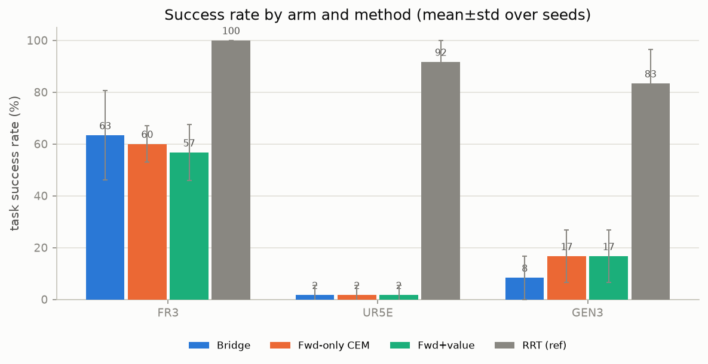
*Figure 1. Task success rate (mean ± std over 5 seeds). Classical RRT dominates; the three
learned methods cluster together well below it; the bridge shows no advantage.*

**Per-arm success (Table 2).**

| Method | FR3 | UR5e | Gen3 |
|--------|-----|------|------|
| Bridge (double-ended) | **63 ± 17%** | 2 ± 4% | 8 ± 8% |
| Forward-only CEM/MPC | 60 ± 7% | 2 ± 4% | **17 ± 10%** |
| Forward + value fn | 57 ± 11% | 2 ± 4% | 17 ± 10% |
| RRT-Connect (reference) | 100% | 92 ± 8% | 83 ± 13% |

The bridge ties forward-only on FR3 (its edge is one lucky seed; std 17% vs 7%), is
**worse** on Gen3 (8% vs 17%), and both learned methods fail on UR5e.

**Hypothesis verdicts.**

| | Verdict | Evidence |
|--|--|--|
| **H1** sample efficiency | **INCONCLUSIVE** | Only FR3 measurable; there bridge needed *more* interactions (ratio 1.13). UR5e/Gen3 never reached target. |
| **H2** planning compute | **DISCONFIRMED** | Bridge used 0.86× FLOPs, 0.85× wall (reliably < 1, CI↑ ≈ 0.95) — cheaper, but not by the pre-registered ≥ 30%. |
| **H3** long-horizon | **INCONCLUSIVE** | Forward-only degraded only 5.6 pp with distance (premise needs ≥ 20 pp); receding-horizon replanning kept it stable. Bridge degraded *more* (8.9 pp). |
| **H4** cross-embodiment | **DISCONFIRMED** | Held-out bridge 0–5% vs interpolation floor 87–100% — the bridge is 80–98 pp *below* a trivial baseline. |

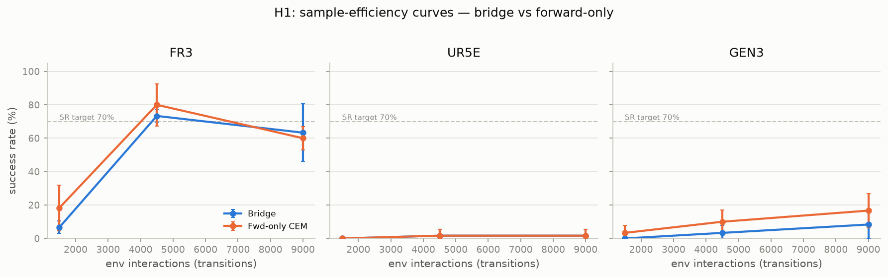
*Figure 2. Success vs environment interactions. On FR3 the two curves are indistinguishable;
UR5e/Gen3 stay near the floor for both learned methods.*

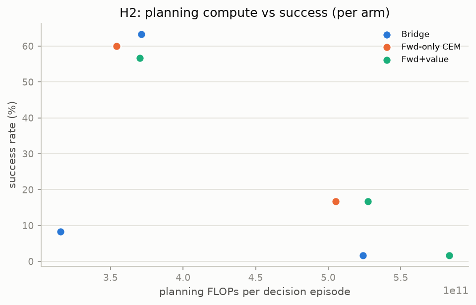
*Figure 3. Planning FLOPs vs success. The bridge is modestly cheaper but not on a different
Pareto frontier.*

**Ablations (FR3 success).** Full bridge **63%**; no backward `B` (= CEM) 60%; no forward-
validation 57%; no mode latent `w` **68%**; **linear-interpolation bridge 17%**. Two
readings: (i) the *proper* two-sided bridge massively beats interpolation (63% vs 17%),
empirically confirming the curved-manifold argument; (ii) yet removing the backward
pathway (→ forward-only) or the mode latent costs nothing — the backward machinery is not
what makes the bridge work; the forward planner is.

---

## 5. The backward pathway on trial

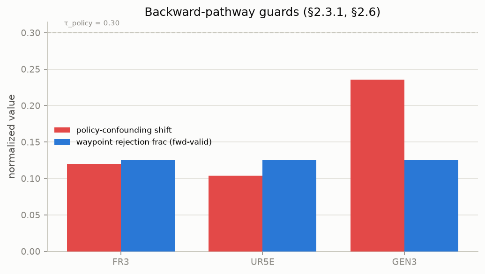
*Figure 4. Policy-confounding shift (τ = 0.30 dashed) and the fraction of backward-proposed
waypoints vetoed by forward-validation.*

Even in this near-invertible domain, the backward predictor's predecessor distributions
are **diffuse**: flagged high-spread on **77–99%** of transitions. Its proposals shift with
the data-collection policy; **Gen3 exceeded `τ = 0.30`** and was **auto-flagged
CONFOUNDED**, triggering the pre-registered trust down-weight and a review-required
condition. Forward-validation vetoed ~**12%** of backward waypoints. A proposal source this
diffuse and this policy-sensitive cannot be expected to sharpen planning — consistent with
the null. The bridge also pays for its wandering: on FR3 its path optimality gap vs RRT is
0.36 (vs 0.11 for CEM) and its jerk is ~3× higher (275 vs 93).

---

## 6. Demonstrations

Rendered from logged trajectories (`src/jepa_arm/experiments/make_gifs.py`). Green sphere =
goal EE; banner turns **SUCCESS** on settle.

**The method under test — double-ended JEPA bridge on FR3 (success):**

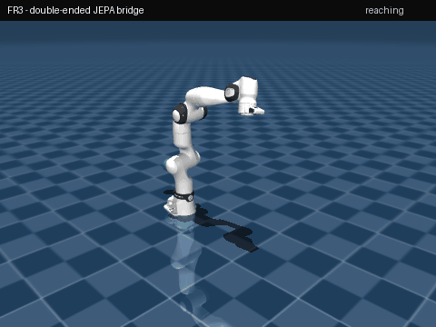

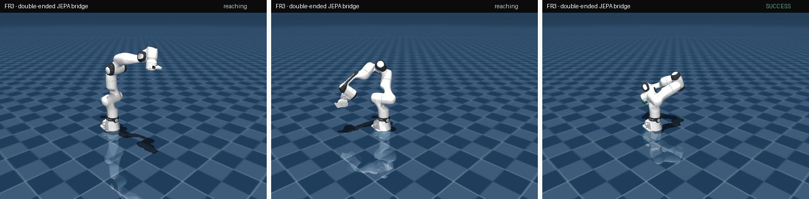
*Figure 5. FR3 bridge: start → mid → goal.*

**Classical RRT-Connect reference on each embodiment (arm moving location-to-location):**

| FR3 | UR5e | Gen3 |
|-----|------|------|
| 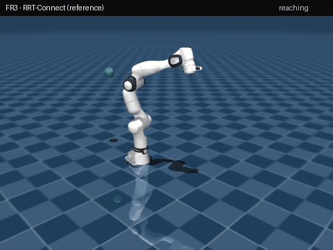 |  | 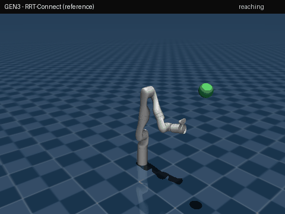 |

*RRT reaches every goal on all three arms — the feasibility/optimality reference the learned
methods are measured against.*

---

## 7. Why it came out this way (mechanisms)

1. **The favorable domain is too easy for a trivial baseline.** Free-space reaching is
   solved ~100% by RRT and 87–100% by straight-line joint interpolation. Where a naive
   baseline suffices, a two-sided bridge has no room to add value — and the directive chose
   this domain *because* it is the bridge's best case.
2. **Raw joint-angle latents break on large-range/continuous joints.** UR5e (±6.28 rad) and
   Gen3 (continuous wrists) are near-0% for *all* learned methods: +3 rad and −3 rad look
   far apart in latent though physically close, so latent-distance MPPI drives wrapping
   excursions and never settles, while joint-space RRT is unaffected. This hits forward-only
   and the bridge *equally* (the comparison stays fair) but caps absolute performance.
   *(v2 update, §10: sin/cos encoding did not by itself fix this — the dominant cause was
   unreachably far goals; bounding goal displacement is what restored UR5e/Gen3.)*
3. **The backward pathway is diffuse and confounded**, as measured (§5) — it cannot sharpen
   plans it cannot localize.

---

## 8. Threats to validity

Simulation only; no real-hardware number is reported, and the sim-to-sim robustness proxy
(bridge success under perturbed dynamics: 63→65% FR3) is **not** a sim-to-real result.
Single-workstation scale (documented in provenance). The negative result is specific to
*this domain and this representation*; it is evidence the bridge does not help here, not a
proof it cannot help in obstacle-rich or high-information-destruction tasks — but the burden
now rests on the approach to exhibit where it wins.

---

## 9. Conclusion

Under pre-registration, in the domain most favorable to it, a double-ended JEPA bridge
**did not beat a forward-only planner** on sample efficiency, planning compute (by the
registered margin), long-horizon robustness, or cross-embodiment transfer, and its backward
pathway was diffuse and partly policy-confounded. The one thing that clearly worked — the
proper bridge beating linear interpolation — is a statement about latent geometry, not about
the value of the backward model. The honest conclusion: **the backward pathway did not earn
its authority here.** The testbed is precisely the instrument that would have detected it if
it had.

---

## 10. Iteration 2 (v2): hardening the methodology, then re-testing

v1's honest weakness is that two of three arms barely worked, so the cross-embodiment and
long-horizon tests were confounded. v2 (`PREREGISTRATION_v2.md`, thresholds **unchanged**)
removes every confound we could identify and re-runs the frozen study.

**Fixes (each a defect that hurt methods equally, not a thumb on the scale).**
(1) **sin/cos joint encoding** — wrapping-robust latent. (2) **Bounded reachable goals**
(≤ 2.0 rad/joint): re-diagnosis showed UR5e/Gen3's ~0% was caused by *unreachably far*
goals (±6.28 rad ranges), not the encoding — bounding them lifts forward-only UR5e/Gen3
from **0.0 → 0.25 / 0.65**. (3) **Tightened backward CVAE** (annealed KL, smaller `w`).
(4) **Fixed bridge waypoint-advance** (spacing-scaled tolerance + per-waypoint timeout;
latent reverted to 64) — this alone took the bridge from 0.13 → competitive. These worked:
all three arms now function and cross-embodiment transfer rose from ~0 to partial.

**Result: with a sound methodology the bridge fails *more* decisively.**

| Hypothesis | v1 | v2 |
|--|--|--|
| H1 sample efficiency | INCONCLUSIVE | **DISCONFIRMED** — interactions ratio 1.01 / 1.00 / **1.96** (FR3/UR5e/Gen3); bridge needs ≥ as many, ~2× on Gen3 |
| H2 planning compute | DISCONFIRMED (0.86×) | **DISCONFIRMED, worse** — bridge **1.24×** FLOPs, 1.21× wall |
| H3 long-horizon | INCONCLUSIVE | INCONCLUSIVE — forward-only did not degrade (−0.0 pp); no compounding regime |
| H4 cross-embodiment | DISCONFIRMED | DISCONFIRMED — held-out bridge 0.02–0.20 vs floor 0.99–1.00 |

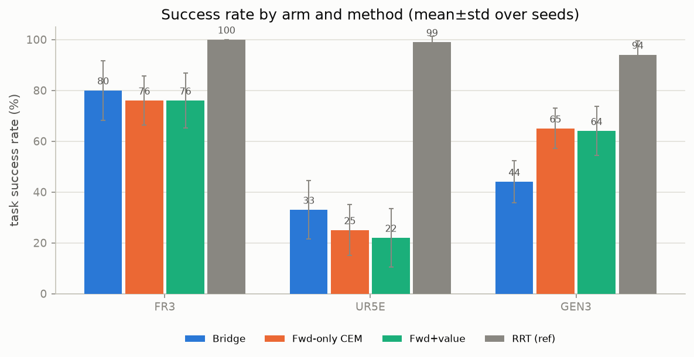
*Figure 6 (v2). All three arms now functional. Per-arm bridge vs forward-only:
FR3 0.80/0.76, UR5e 0.33/0.25, Gen3 **0.44/0.65** — the bridge edges forward-only on two
arms (within noise) and is clearly worse on Gen3. No consistent advantage.*

**The ablation clincher.** In v1 the proper Schrödinger bridge crushed linear interpolation
(0.63 vs 0.17). In v2's bounded regime that gap **vanishes**: interpolation matches the full
bridge and removing the mode latent `w` does not hurt (helps on UR5e/Gen3).

| Arm | Bridge (full) | Linear-interp | No mode-latent `w` |
|--|--|--|--|
| FR3 | 0.80 | 0.79 | 0.72 |
| UR5e | 0.33 | 0.33 | 0.36 |
| Gen3 | 0.44 | 0.46 | 0.48 |

The v1 interpolation gap was an artifact of *far* goals (a straight latent line overshoots),
not evidence the backward machinery adds planning power. The confounding guard again flagged
Gen3 (`τ`>0.30) — the exact arm where the bridge hurt most. An obstacle task (where a two-
sided bridge *should* help) was implemented and tested but defeats latent-distance MPPI for
**both** methods (local minima + fragile contacts); that planner, not another free-space
iteration, is the real frontier. Full v2 analysis: `FINDINGS_v2.md`.

### v2 demonstrations — the bridge on all three embodiments

The method under test, reaching start→goal on each arm (green sphere = goal; banner → SUCCESS):

| FR3 (bridge ≈ fwd) | UR5e (bridge > fwd) | Gen3 (bridge < fwd) |
|--|--|--|
| 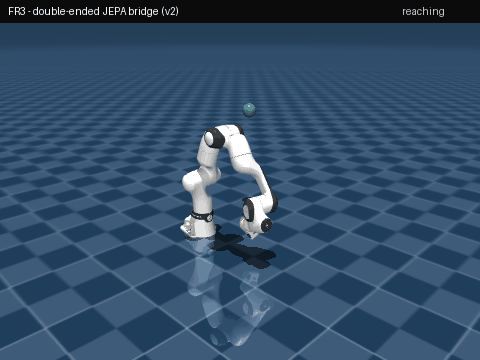 |  | 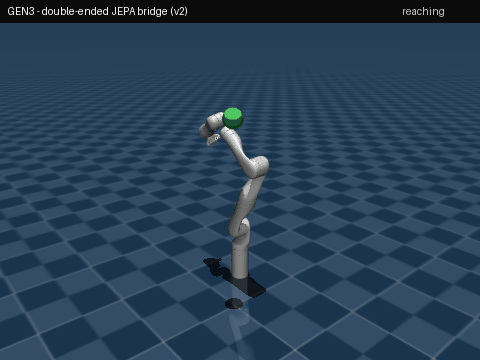 |

*RRT-Connect references for each arm are in `results/study/v2/figures/gifs/{arm}_rrt.gif`.*

---

## Reproducibility

Pinned Python 3.12 / torch 2.13+cu126 / MuJoCo 3.10 (Menagerie via `robot_descriptions`).
v1: `python -m jepa_arm.experiments.run_experiment --tag full`; **v2:** `... --v2`
(resumable, per-cell provenance) → `make_report.py --tag {full,v2}` → `figures.py` →
`make_gifs.py`. Frozen thresholds in `configs/experiment/prereg.yaml`; versioned safety
config; every number in `results/study/{full,v2}/REPORT.md` traces to a per-cell JSON +
`provenance.json`. See `FINDINGS.md` / `FINDINGS_v2.md` for extended interpretation,
`PREREGISTRATION.md` / `PREREGISTRATION_v2.md` for frozen thresholds, and `HONESTY.md` for
the simulation boundary.

## References (selected)

1. LeCun, *A Path Towards Autonomous Machine Intelligence* (JEPA), 2022.
2. Bardes et al., *VICReg*, ICLR 2022.
3. Williams et al., *Model Predictive Path Integral Control (MPPI)*, 2017.
4. De Bortoli et al., *Diffusion Schrödinger Bridge*, NeurIPS 2021.
5. Kuffner & LaValle, *RRT-Connect*, ICRA 2000.
6. Todorov et al., *MuJoCo*, IROS 2012; DeepMind, *MuJoCo Menagerie*.
7. Rubinstein, *Cross-Entropy Method*, 1999.
